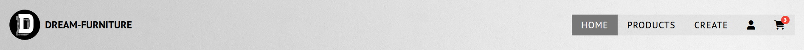
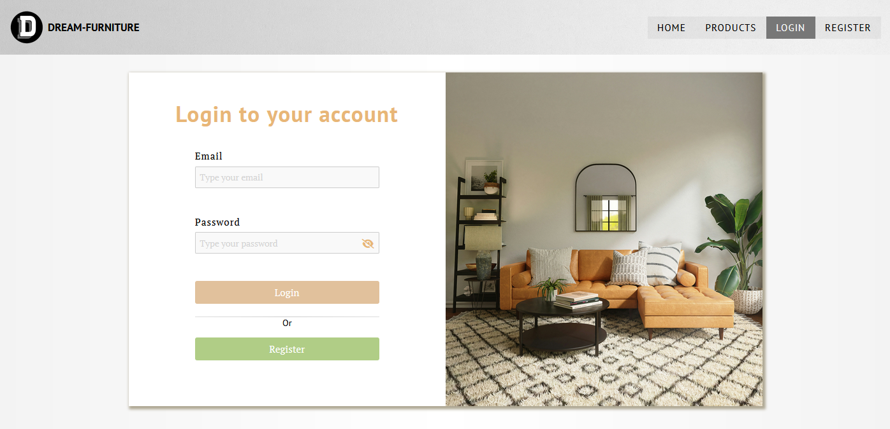

# DreamFurniture

This project was generated with [Angular CLI](https://github.com/angular/angular-cli) version 17.1.0.

## Content table

Authentication

## Authentication

### Login and register

Upon login/register the following happens:

- The browser sets a cookie: “auth-cookie”, containing the authorization token, returned from the server
- The created user is emitted as new value to all subscribers of the user Observable.
- The created user is set in the local storage

### Session - authComponent

An authentication component wraps the whole application, and its purpose is to keep the session, after reloading, navigating or other renders that would make the user Observable empty again. By checking the local storage and the _auth-cookie,_ the component itself does the following operations:

#### Case 1: Cookie and user intact

In the case where both the user in the storage and the _auth-cookie_ are intact, the component calls the _setUserSubject_ function from the service, emitting the user from the localStorage to the subscribers

#### Case 2: User is missing

If the user is missing from the local storage, but the _auth-cookie_ is intact, the component checks the validity of the token saved in the cookie by sending an API Request.

- Valid token: If the token is valid, the server returns the current user and the function that handles the request, sets the user in the local storage and emmits the new user to the observables.
- Invalid token: Otherwise, if the token is not valid, the server responds with status code 401 - Unauthorized. The interceptor handles this kind of response by clearing the whole session (cookie, user in the localStroage and BehaviourSubject)

#### Case 3: Cookie is missing

If neither the cookie nor the user in the storage are intact, the component clears the whole session as in the second case with the invalid token.

### Aspects of the approach

- **Single Source of Truth:** By relying on the server for user information.
- **Reduced Requests:**
  Utilizing localStorage effectively reduces the number of requests to the server for checking user login status during renders and reloads.
- **Session Handling:** The _authComponent_ handles session continuity across different scenarios, making the user experience smoother.

## Application overview

### Header

The header component servers as the main navigation of the application, providing quick access to features and pages. Depending on the client's authentication status the header includes the following navigation:

- Guest (not logged in)
  - Home - Directs to the home page.
  - Products - Clicking on the Products link allows users to explore the complete collection of products offered.
  - Login - Leads to the dedicated Login page.
  - Register - Link to a page, where guests can create an account to unlock more features.

- Users (logged in)
  - Home
  - Products
  - Profile (icon) - Clicking the button reveals a dropdown menu with profile page and wishlist links and an option to logout.
  - Cart (icon) - Directs to the user's cart. If the user has items in the cart, their total count is showed in the upper right corner

### Home page

The home page servers as the main landing page. It provides an interface to browse the oldest published furnitures with summarizzed information. Upon clicking on the item itself, the user is taken to the detailed page of the furniture.

#### A view of the homepage:

---

### Products page

The Products page provides a complete list of all furniture items offered on the platform. The users can sort, filter and search the items based on the their preferences. Each product on the page includes brief display of the essential information and a detailed page of the product can be opened by clicking on the image.

#### Filtering

Users can filter the products based on their categories (The type of room they are suitable for)

- All
- Living room
- Bedroom
- Dining room
- Home office
- Outdoor

#### Search functionality

The products page provides a search bar that enables users to find specific products efficiently by the product's name. The match is case-insensitive.

#### Sort functionality

Users can sort the products based on some of their properties:

- Alphabetically by name
- Time of creation (Oldest and Newest)
- Price (Ascending and descending)

#### URL state and reseting

The URL link in the app captures the current state of the page, including filters, sorting, and search. Sharing that link allows the user to easily collaborate and share specific information with others.

Additionaly the page has a RESET button, which resets all sorting and filtering.

#### A view of the products page:

---

### Product details page

This page provides a comprehensive view of the furniture, offering the users detailed information about the product and providing additional controls (adding to wishlist and adding to cart).

The first section of the page consist of an image, essential information and controls based on user authentication.
The second section displays detail information about the product's dimensions, material etc.

#### A view of the products page

---

#### Views based on authentication

---

| Guest                                                                           | User                                                                               | Owner                                                |
| ------------------------------------------------------------------------------- | ---------------------------------------------------------------------------------- | ---------------------------------------------------- |
| If the user is not authenticated, he is presented with Login and register links | The user has access to a wishlist and cart, where he can put his desired products. | The owner of the product can modify it or delete it. |
|                              |                                   |   |

### Register page

The register page provides a form with inputs where a guest, who still doesn't have an account can create one. If he wished to access additional features he has to fill the input with his email, username and password.

### Login page

The login page provides a form featuring two input fields. One for the email and one for the password. To login the users must fill the inputs with the right email and password and submit the form.

The form validates all fields and displays error messages for invalid entries:

### Create and Edit pages

Authenticated users can add their products with the form provided on the create page. The same page is used when the user wants to update already created product, with the only difference that the inputs are filled with the current product properties. Each input is validated with the same styling in the register and login pages. The following data should be provided in the inputs:

- name - string
- description - string
- image - URL to the image
- category - multiple option select
- style - string
- height - number
- width - number
- depth - number
- material - multiple option select
- color - select
- price - number (integer or number with two deciamal places)

### Profile page

Users can open their profile page, where they can see all the products they have posted, their profile and information and controls to edit the profile, link to the user's wishlist and logout link.

#### Profile page view 

---

The edit button opens up a modal with email and username inputs. The has to change the values and submit the form to update his profile information.

#### Edit profile modal view

---

### Wishlist

Authenticated users can create their own wishlist and manage their favorite products. The wishlist features a brief display of each product in it. Uppon clicking the image the user is taken to details page of the product. A `Add to cart` button is also provided, which adds the product the user's cart. 

#### Wishlist view

---

|Wishlist with items|Empty wishlist|
|-|-|
|||

### Cart

The cart is the place where the user can see his final presentation of the products he wants to buy with their price (per product, total price of the current product, overall total price). From the cart, he can manage all products (incrementing or decerementing the count of a product and removing the product from the cart). Upon removing the item from the cart, a modal is displayed and the user has to confirm he wants to remove the item from the cart.

#### Cart view

---

#### Empty cart view

---

